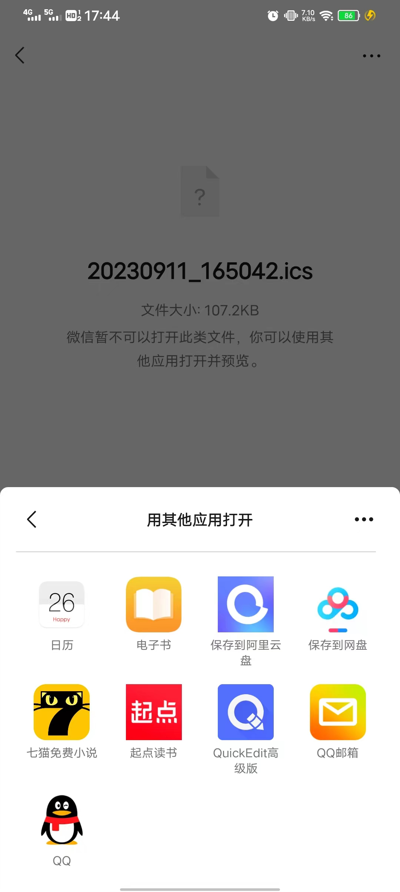

# 课程表导入日历助手

本工具旨在帮助大学生方便查看自己的课程。

## 功能简介

用户可以使用该软件生成一个可以导入手机日历、Outlook等邮箱的文件，进而方便用户在手机查看课程信息。

## 下载方式

可以从以下方式获取本软件：

- [GitHub Release]()
- [Gitee Release (GitHub镜像)]()
- [蓝奏云]()

## 使用方法

### Step 1: 设置课节
1. 打开软件，如图

2. 打开“设置课节.xlsx”，按图中和文件中的提示操作

3. 填完后，按图中提示操作，另存为“设置课节.csv” 下面是Microsoft Office的操作界面：

下面是WPS的操作界面：

4. 返回应用程序，点击第一个按钮，出现如图提示则说明导入成功

### Step 2: 设置课程

1. 打开“设置课程.xlsx”，按图中和文件中的提示操作

2. 填完后，按图中提示操作，另存为“设置课程.csv”，与第一步中的操作类似
3. 返回应用程序，点击第二个按钮，出现如图提示则说明导入成功

### Step 3: 设置提醒

在框中输入提前提醒的分钟数。如果不填，则不提醒。只可以填入正整数，如图所示

### Step 4: 设置起始日期

在第四个框内输入**校历上的第一周第一天**对应的日期，如图所示

### Step 5: 导出文件

点击“生成ics文件”按钮，生成文件

出现如图所示的提示说明生成成功

文件会出现在exe同目录下

### Step 6: 导入日历等软件

下面以 vivo FuntouchOS 为例演示如何导入手机日历。

1. 用微信、QQ等将生成的文件分享到手机上

2. 点击选择“用其他应用打开”

3. 选择你想导入的应用，如系统日历软件、邮箱等

4. 点击允许，跳转到日历

5. 点击确定，导入成功

## 注意事项

1. 本程序暂时只支持东八区正常使用，但不保证后续一定会更新对其他时区的支持。如果其他时区的用户想要使用本软件，可以人为将时间转换到东八区
2. 提前提醒的方式为手机通知，具体形式可能由于机型不同而有所区别
3. 本程序只能为用户的准时上课添加一层保障，对用户使用本软件后发生的迟到或缺勤不负任何责任
4. 具体填写的说明请参照对应界面。

## 支持我们

你可能以为我是要恰饭，其实……

**走过路过点个Star呗~**
